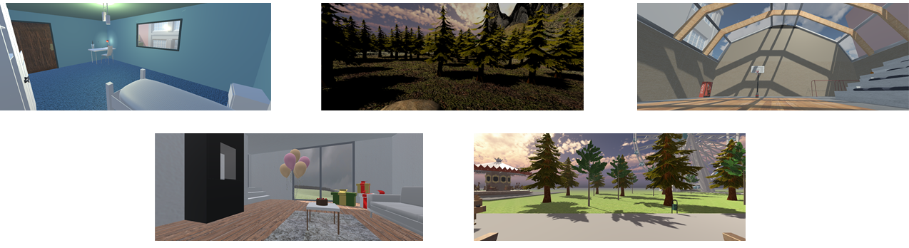

# VERA - Virtual Environments Recording Attention

This repository consists of a Unity Project describing a software aiming to promote attention in Virtual Reality (VR) environments. This software has been designed to be used with HTC-Vive Pro Eye with the Tobii Eye-tracking tools (https://www.vive.com/fr/product/vive-pro-eye/).

Five different environments in VR have been created, they aim to promote attention and record physiological during the accomplishment of attentional tasks. The environments are represented in the following image: 
.

To use the environments, the instructions are the following: 
- Download the project (or at least the "[VERA - Virtual Environment Recording Attention](VERA%20-%20Virtual%20Environment%20Recording%20Attention)" directory). 
- Plug the VR headset.
- Turn on Steam-VR (if not installed [link](https://store.steampowered.com/steamvr?l)).
- Turn on Vive SRanipal SDK (if not installed [link](https://developer.vive.com/resources/knowledgebase/vive-sranipal-sdk/)).
- Click on "VERA - Virtual Environment Recording Attention.exe".

After playing the game, two different directories will be created: one with physiological signals (RawSignals_ ...) and one with the results of the Attentional Tasks (TaskRecords_ ...). 
ADD TASK DESCRIPTION

Physiological signals are recorded according to the following template: 

| Time  [ms]  | Head Linear Position (x) [m] | Head Linear Position (y) [m] | Head Linear Position (z) [m] | Head Rotational Position (x) [deg] | Head Rotational Position (y) [deg] | Head Rotational Position (z) [deg] | Eye Position (x) [m] | Eye Position (y) [m] | Eye Position (z) [m] | Eye Direction (x) | Eye Direction (y) | Eye Direction (z)  | Pupil Diameter [mm]  | Blinking Left | Blinking Right |
| ----------- |:----------------------------:|:----------------------------:|:----------------------------:|:------------------------------------:|:----------------------------------:|:----------------------------------:|:--------------------:|:--------------------:|:--------------------:|:-----------------:|:-----------------:|:------------------:|:--------------------:|:-------------:| --------------:| 
| 200        |-1.99141    |2.26483|-0.05904|-0.05904|2.46575|355.48395 |    -1.992    |2.266    |-0.055    |0.027|    -0.043    |0.999    |2.733|    0.000    |0.000|
|400    |-1.99143|    2.26459|    -0.05850|    358.13217    |2.49773    |355.46933    |-1.993|    2.266    |-0.054|    0.022    |-0.050    |0.998|    2.537|    0.000    |0.000|
|...|...|...|...|...|...|...|...|...|...|...|...|...|...|...|...

## Signal Analysis 

In the "[Signal Analysis Intro](Signal%20Analysis%20Intro/)" directory a [notebook](Signal%20Analysis%20Intro/VERA%20-%20Signal%20Analysis%20Pipeline%20.ipynb) **Python 3.7** is presented with the introduction of the signal processing pipeline that can be used to process the dataset created by the VR environments. In addition to the signal from the VR headset, an EEG file synchronised has been added. The different step leading to a first step signal classification (attentive/Not attentive) is presented. 

For this purpose different libraries have to be installed by typing `pip install requirements.txt`. After installing the libraries, the code can easily be implemented by running the notebook. 
